<h2>TensorFlow-FlexUNet-Image-Segmentation-Car-Damages (2025/12/25)</h2>
Toshiyuki Arai 
Software Laboratory antillia.com  
This is the first experiment of Image Segmentation for Car-Damages 
based on our <a href="./src/TensorFlowFlexUNet.py">TensorFlowFlexUNet</a> (TensorFlow Flexible UNet Image Segmentation Model for Multiclass) , 
and <a href="https://drive.google.com/file/d/1rPQ4P08LgcFePtKWHcRKn5pQQM9K2lfV/view?usp=sharing">
Augmented-Car-Damages-ImageMask-Dataset.zip</a> which was derive by us from
 <a href="https://humansintheloop.org/resources/datasets/car-parts-and-car-damages-dataset/"><b>Car Parts and Car Damages Dataset</b></a>
  

<b>Actual Image Segmentation for Car-Damages Images</b> 
As shown below, the inferred masks predicted by our segmentation model trained by the dataset appear similar to the ground truth masks, but they lack precision in certain areas.
 
<a href="#color-class-mapping-table">Color class mapping table</a>
 
<table>
<tr>
<th>Input: image</th>
<th>Mask (ground_truth)</th>
<th>Prediction: inferred_mask</th>
</tr>
<tr>
<td>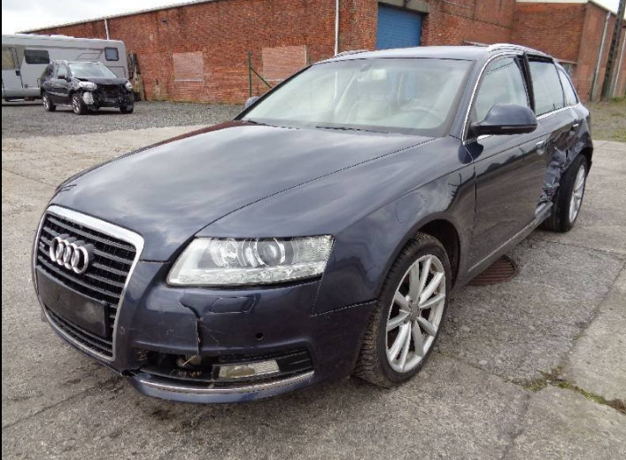</td>
<td>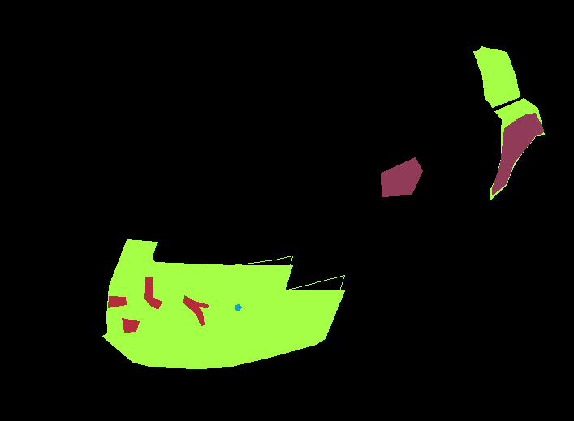</td>
<td>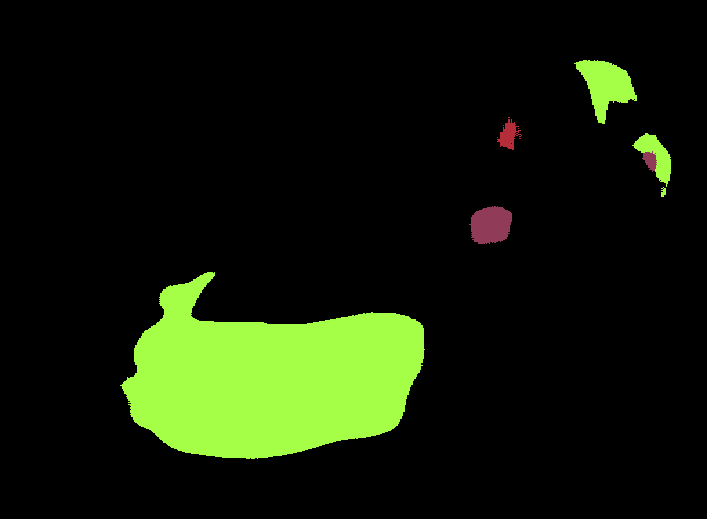</td>
</tr>

<tr>
<td>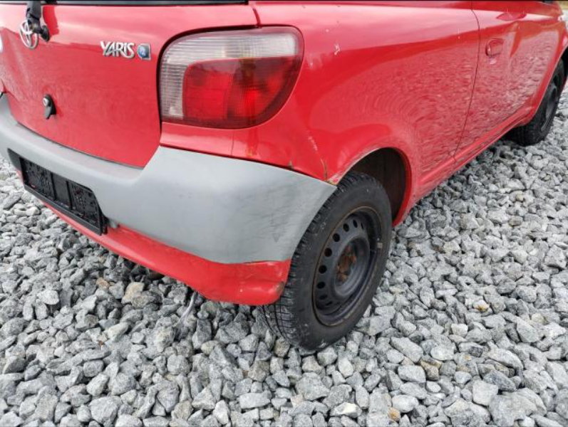</td>
<td></td>
<td></td>
</tr>

<tr>
<td>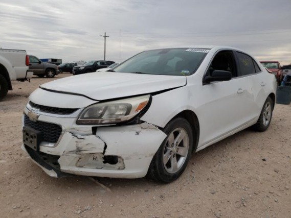</td>
<td>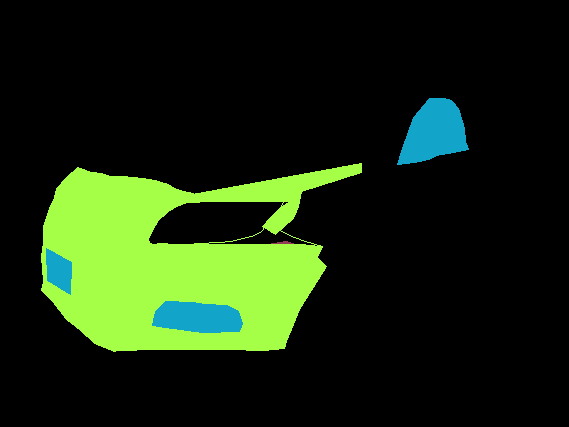</td>
<td>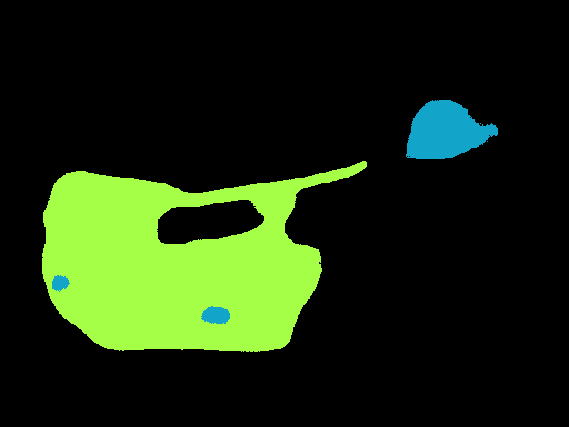</td>
</tr>
</table>

 
<h3>1  Dataset Citation</h3>
The dataset used here was derived from   
 <a href="https://humansintheloop.org/resources/datasets/car-parts-and-car-damages-dataset/"><b>Car Parts and Car Damages Dataset</b></a>
  
<b>Free Car Parts and Car Damages Dataset</b> 
Humans in the Loop is proud to share our newest dataset for car part and car damage analysis AI systems for automated claims processing. 
 The dataset consists of a total of 1812 images, fully annotated with polygons either for car parts (998 images) or car damages (814).  
The total number of polygons in the dataset is 24,851.  
The images were segmented by the trainees of Beetroot Academy as part of their pilot with Humans in the Loop, targeting internally displaced people across Ukraine.
  
<b>Dataset size</b> 
1812 images, split into car parts (998 images) and car damages (814).
  
<b>Classes</b> 
1. For car parts, classes  include: Windshield, Back-windshield, Front-window, Back-window, Front-door, Back-door, Front-wheel, Back-wheel, Front-bumper, Back-bumper, Headlight, Tail-light, Hood, Trunk, License-plate, Mirror, Roof, Grille, Rocker-panel, Quarter-panel, Fender
  
2. For car damages, classes include: Dent, Cracked, Scratch, Flaking, Broken part, Paint chip, Missing part, Corrosion
  
<b>License</b> 
This Car part and car damage dataset is dedicated to the public domain by Humans in the Loop under CC0 1.0 license.
</a>
 
 
<h3>
2 Car-Damages ImageMask Dataset
</h3>
<h4>
2.1  Download Car-Damages ImageMask Dataset
</h4>
 If you would like to train this Car-Damages Segmentation model by yourself,
 please download our dataset from the google drive  
<a href="https://drive.google.com/file/d/1rPQ4P08LgcFePtKWHcRKn5pQQM9K2lfV/view?usp=sharing">
Augmented-Car-Damages-ImageMask-Dataset.zip</a>
, expand the downloaded, and put it under  <b>./dataset </b> to be.  
<pre>
./dataset
└─Car-Damages
    ├─test
    │   ├─images
    │   └─masks
    ├─train
    │   ├─images
    │   └─masks
    └─valid
        ├─images
        └─masks
</pre>
 
<b>Car-Damages Statistics</b> 
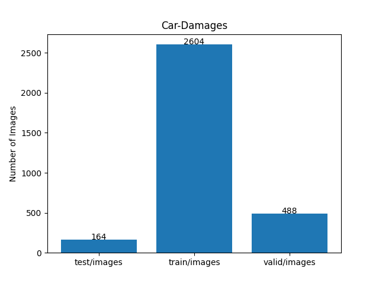 
 
As shown above, the number of images of train and valid datasets is large enough to use for a training set of our segmentation model.
 
<h4>
2.2  Car-Damages ImageMask Derivation
</h4>
The folder structure of the <b>Car damages dataset (renamed by us) </b> subset is the following. 
<pre>
./Car damages dataset 
└─File1
     ├─ann
     │   ├─Car damages 101.png.json
     ...
     │   └─Car damages 1352.jpg.json
     ├─img
     │   ├─Car damages 101.png
     ...
     │   └─Car damages 1352.jpg   
     ├─masks_human
     └─masks_machine
</pre>
We used the following 3 Python scripts to derive our augmented dataset from the <b>File1/ann</b> and 
<b>File1/img</b> in <b>Car damages dataset</b> subset of 
 <a href="https://humansintheloop.org/resources/datasets/car-parts-and-car-damages-dataset/"><b>Car Parts and Car Damages Dataset</b></a>
 <ul>
<li><a href="./generator/MaskGenerator.py">MaskGeneratory.py</a></li>
<li><a href="./generator/ImageMaskDatasetGenerator.py">ImageMaskDatasetGeneratory.py</a></li>
<li><a href="./generator/split_master.py">split_maskter.py</a></li>
</ul>
 
Step1: Generated  colorized mask files  from the json files in <b>File1/ann</b> folder by using the MaskGenerator. 
Step2: Generated  augmented image and mask dataset from  the original image files and the colorized mask files  by using the ImageMaskDatasetGenerator. 
Step3: Split the augmented dataset into test, train and valid subsets by using the splitting tool. 
 
We also used the following color-class mapping table to generate the colorized masks and define a rgb_map mask format between indexed colors and rgb colors
in <a href="./projects/TensorFlowFlexUNet/Car-Damages/train_eval_infer.config">train_eval_infer.config</a>.
 
 
<a id="color-class-mapping-table"><b>Car-Damages color class mapping table</b></a>
<table border=1 style='border-collapse:collapse;' cellpadding='5'>
<tr><th>Indexed Color</th><th>Color</th><th>RGB</th><th>Class</th></tr>
<tr><td>1</td><td with='80' height='auto'></td><td>(19, 164, 201)</td><td>Missing_part</td></tr>
<tr><td>2</td><td with='80' height='auto'></td><td>(166, 255, 71)</td><td>Broken_part</td></tr>
<tr><td>3</td><td with='80' height='auto'></td><td>(180, 45, 56)</td><td>Scratch</td></tr>
<tr><td>4</td><td with='80' height='auto'></td><td>(225, 150, 96)</td><td>Cracked</td></tr>
<tr><td>5</td><td with='80' height='auto'></td><td>(144, 60, 89)</td><td>Dent</td></tr>
<tr><td>6</td><td with='80' height='auto'></td><td>(167, 116, 27)</td><td>Flaking</td></tr>
<tr><td>7</td><td with='80' height='auto'></td><td>(255, 0, 255)</td><td>Paint_chip</td></tr>
<tr><td>8</td><td with='80' height='auto'></td><td>(115, 194, 206)</td><td>Corrosion</td></tr>
</table>
 
<h4>
2.3  Car Damages Image and Mask Samples
</h4>

<b>Train_images_sample</b> 
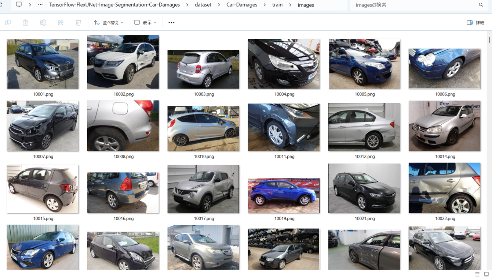
 
<b>Train_masks_sample</b> 
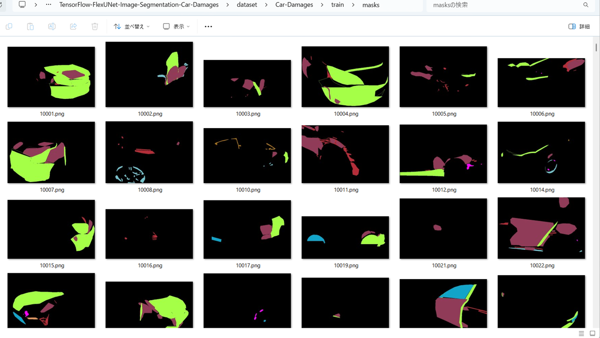
 

<h3>
3 Train TensorflowFlexUNet Model
</h3>
 We trained Car-Damages TensorflowFlexUNet Model by using the following
<a href="./projects/TensorFlowFlexUNet/Car-Damages/train_eval_infer.config"> <b>train_eval_infer.config</b></a> file.  
Please move to ./projects/TensorFlowFlexUNet/Car-Damages and run the following bat file. 
<pre>
>1.train.bat
</pre>
, which simply runs the following command. 
<pre>
>python ../../../src/TensorFlowFlexUNetTrainer.py ./train_eval_infer.config
</pre>

<b>Model parameters</b> 
Defined a small <b>base_filters=16</b> and a large <b>base_kernels=(11,11)</b> for the first Conv Layer of Encoder Block of 
<a href="./src/TensorflowUNet.py">TensorflowUNet.py</a> 
and a large num_layers (including a bridge between Encoder and Decoder Blocks).
<pre>
[model]
image_width    = 512
image_height   = 512
image_channels = 3
input_normalize = True
normalization  = False

num_classes    = 9

base_filters   = 16
base_kernels   = (11,11)
num_layers     = 8

dropout_rate   = 0.05
dilation       = (1,1)
</pre>

<b>Learning rate</b> 
Defined a small learning rate.  
<pre>
[model]
learning_rate  = 0.00007
</pre>

<b>Loss and metrics functions</b> 
Specified "categorical_crossentropy" and "dice_coef_multiclass". 
<pre>
[model]
loss           = "categorical_crossentropy"
metrics        = ["dice_coef_multiclass"]
</pre>
<b >Learning rate reducer callback</b> 
Enabled learing_rate_reducer callback, and a small reducer_patience.
<pre> 
[train]
learning_rate_reducer = True
reducer_factor     = 0.5
reducer_patience   = 4
</pre>
<b>Early stopping callback</b> 
Enabled early stopping callback with patience parameter.
<pre>
[train]
patience      = 10
</pre>
<b></b> 
<b>RGB color map</b> 
rgb color map dict for Car-Damages 1+8 classes. 
<pre>
[mask]
mask_file_format = ".png"
;Car-Damages 1+8
rgb_map={(0,0,0):0,(19,164,201):1,(166,255,71):2,(180,45,56):3,(225,150,96):4,(144,60,89):5,(167,116,27):6,(255,0, 255):7,(115,194,206):8,}
</pre>
<b>Epoch change inference callbacks</b> 
Enabled epoch_change_infer callback. 
<pre>
[train]
epoch_change_infer       = True
epoch_change_infer_dir   =  "./epoch_change_infer"
epoch_changeinfer        = False
epoch_changeinfer_dir    = "./epoch_changeinfer"
num_infer_images         = 6
</pre>
By using this epoch_change_infer callback, on every epoch_change, the inference procedure can be called
 for 6 images in <b>mini_test</b> folder. This will help you confirm how the predicted mask changes 
 at each epoch during your training process.    
<b>Epoch_change_inference output at starting (1,2,3)</b> 
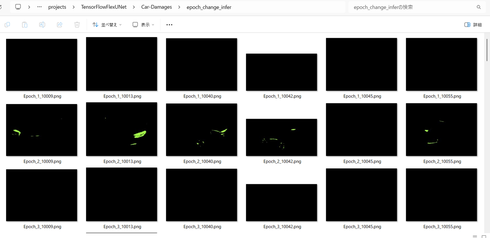 
 
<b>Epoch_change_inference output at ending (21,22,23)</b> 
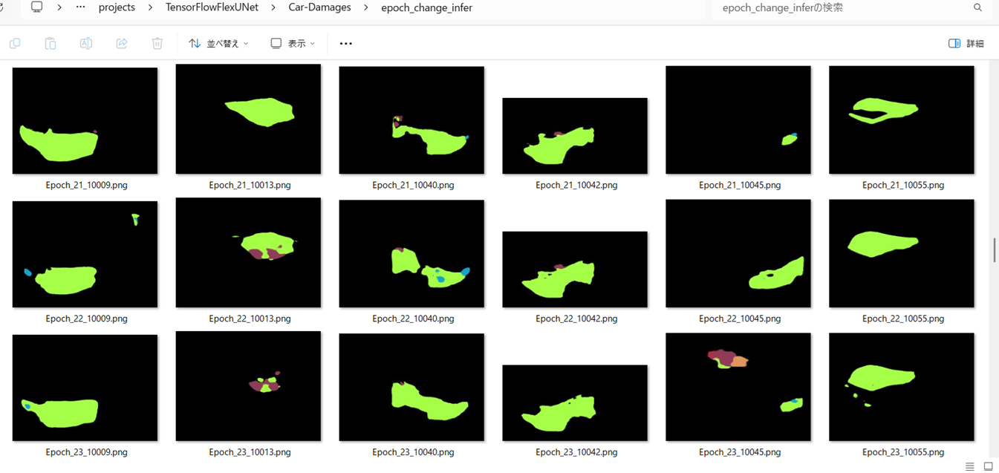 
 
<b>Epoch_change_inference output at ending (43,44,45)</b> 
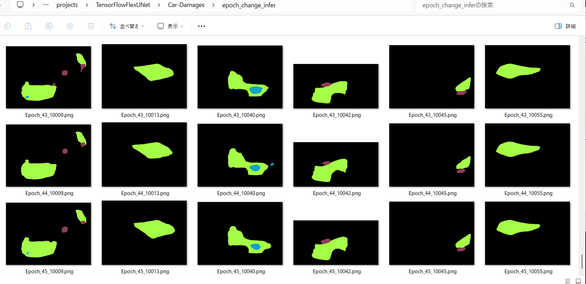 

 
In this experiment, the training process was stopped at epoch 45 by EarlyStoppingCallback.  
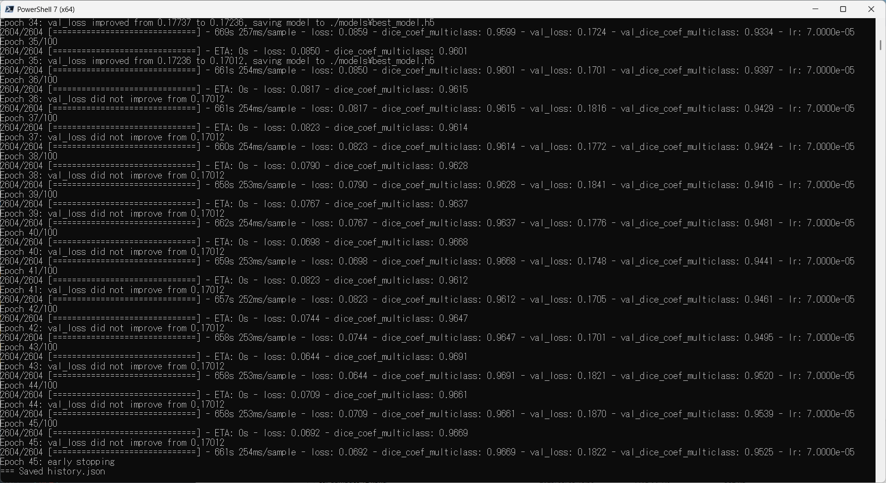 
 
<a href="./projects/TensorFlowFlexUNet/Car-Damages/eval/train_metrics.csv">train_metrics.csv</a> 
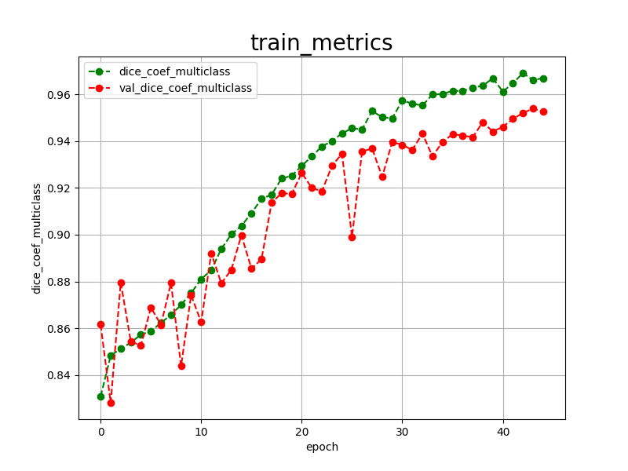 

 
<a href="./projects/TensorFlowFlexUNet/Car-Damages/eval/train_losses.csv">train_losses.csv</a> 
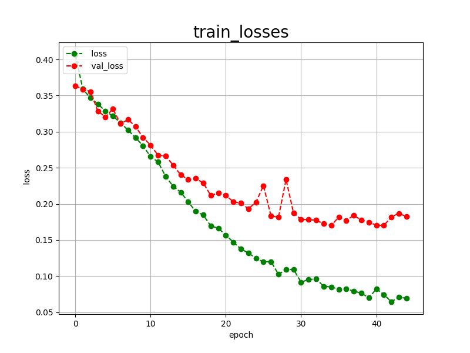 
 
<h3>
4 Evaluation
</h3>
Please move to a <b>./projects/TensorFlowFlexUNet/Car-Damages</b> folder, 
and run the following bat file to evaluate TensorflowFlexUNet model for Car-Damages. 
<pre>
>./2.evaluate.bat
</pre>
This bat file simply runs the following command.
<pre>
>python ../../../src/TensorFlowFlexUNetEvaluator.py  ./train_eval_infer.config
</pre>
Evaluation console output: 
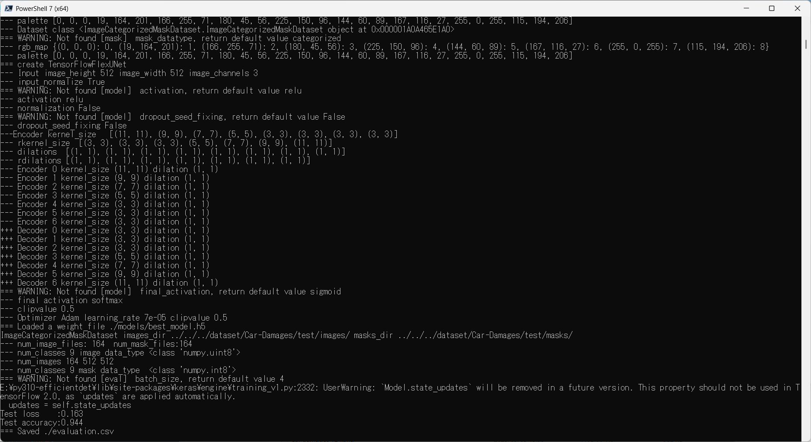
  Image-Segmentation-Car-Damages

<a href="./projects/TensorFlowFlexUNet/Car-Damages/evaluation.csv">evaluation.csv</a> 
The loss (categorical_crossentropy) to this Car-Damages/test was not low, and dice_coef_multiclass  not high as shown below.
 
<pre>
categorical_crossentropy,0.163
dice_coef_multiclass,0.944
</pre>
 
<h3>5 Inference</h3>
Please move to a <b>./projects/TensorFlowFlexUNet/Car-Damages</b> folder 
,and run the following bat file to infer segmentation regions for images by the Trained-TensorflowFlexUNet model for Car-Damages. 
<pre>
>./3.infer.bat
</pre>
This simply runs the following command.
<pre>
>python ../../../src/TensorFlowFlexUNetInferencer.py ./train_eval_infer.config
</pre>

<b>mini_test_images</b> 
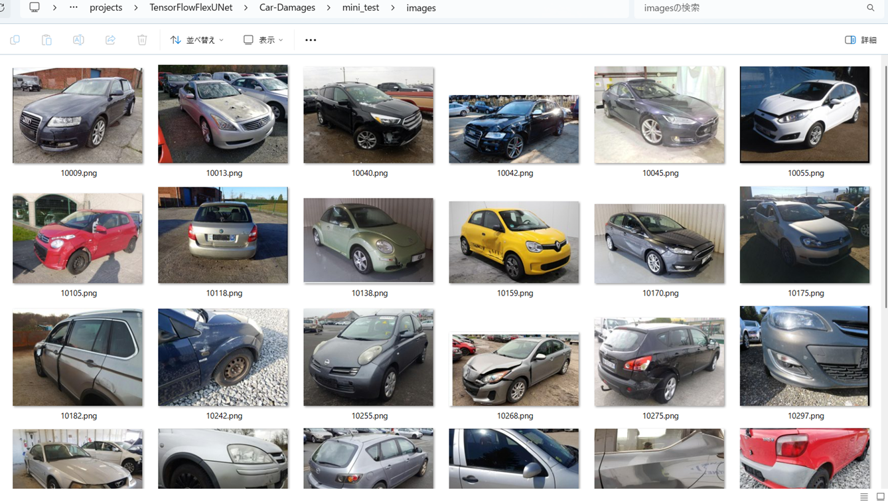 
<b>mini_test_mask(ground_truth)</b> 
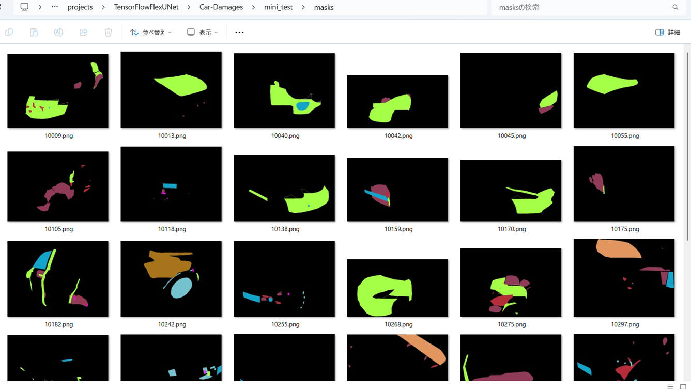 

<b>Inferred test masks</b> 
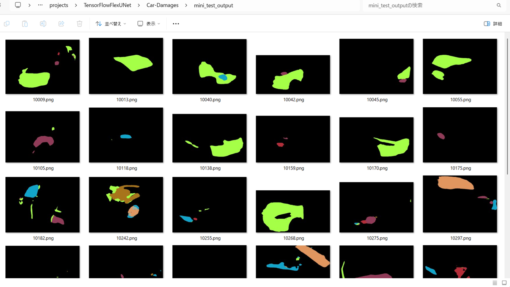 
 

<b>Enlarged images and masks for Car-Damages Images</b> 
As shown below, the inferred masks predicted by our segmentation model trained by the dataset appear similar to the ground truth masks, but they lack precision in certain areas.
 
<a href="#color-class-mapping-table">Color class mapping table</a>
 
<table>
<tr>
<th>Input: image</th>
<th>Mask (ground_truth)</th>
<th>Prediction: inferred_mask</th>
</tr>
<tr>
<td>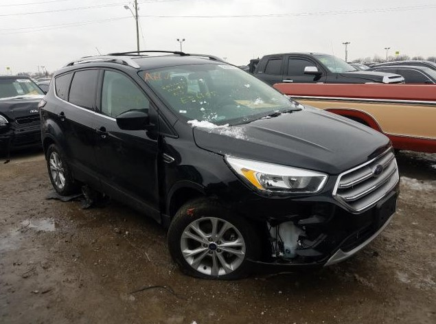</td>
<td>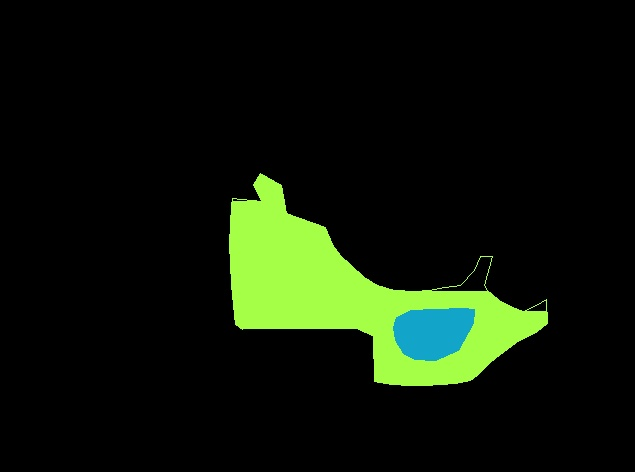</td>
<td>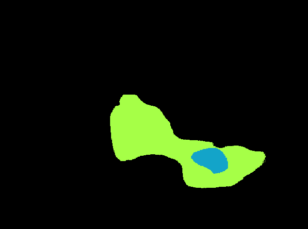</td>
</tr>

<tr>
<td>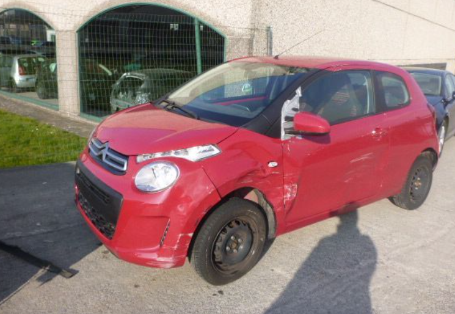</td>
<td>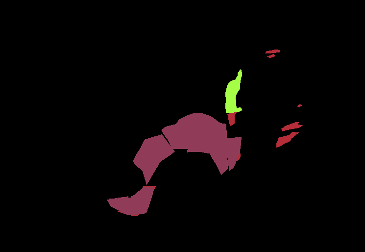</td>
<td></td>
</tr>

<tr>
<td>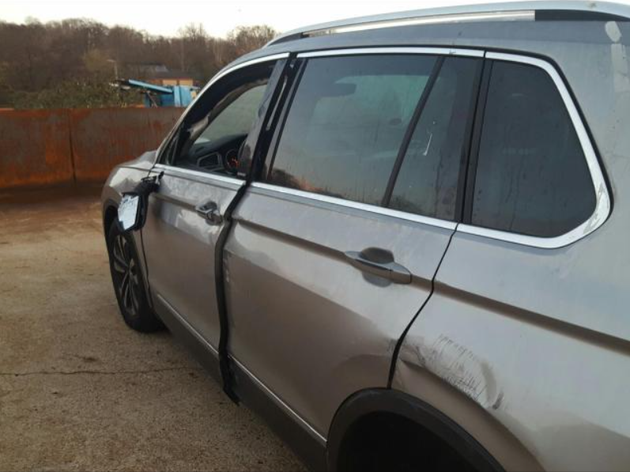</td>
<td>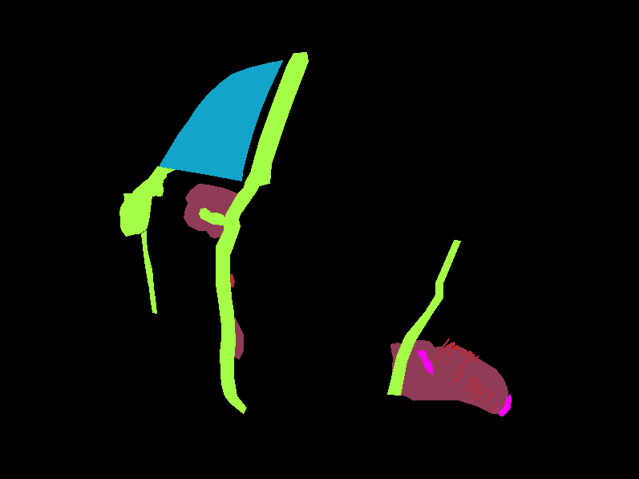</td>
<td></td>
</tr>
<tr>
<td>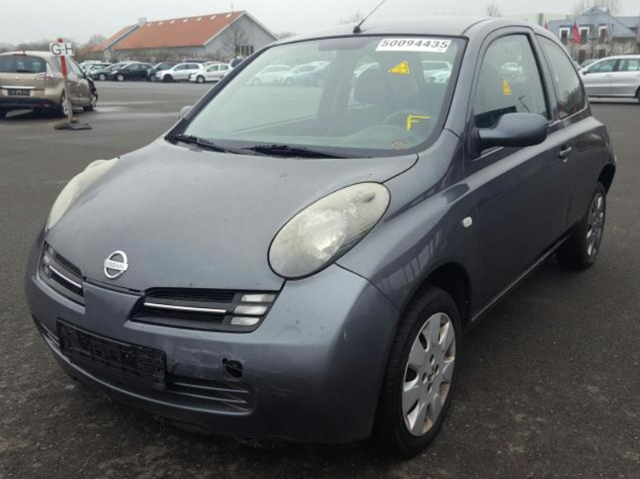</td>
<td>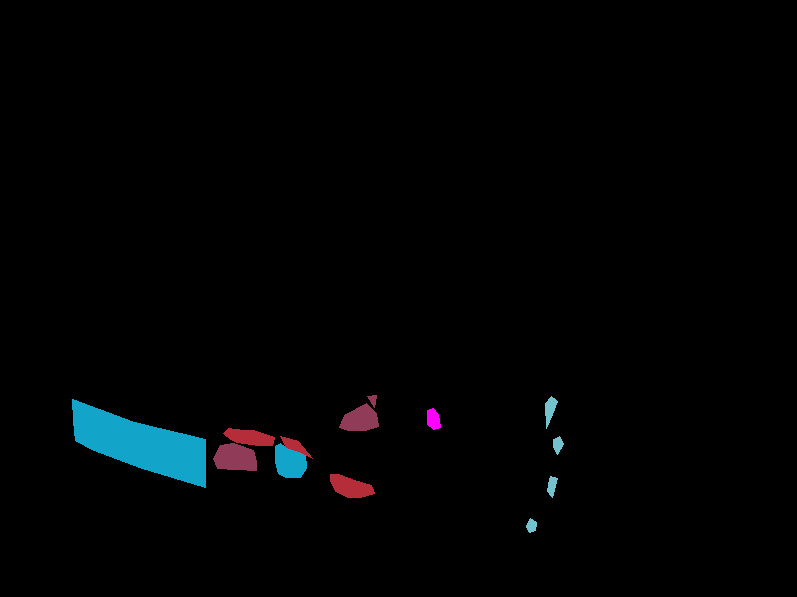</td>
<td></td>
</tr>
<tr>
<td></td>
<td></td>
<td></td>
</tr>
<tr>
<td>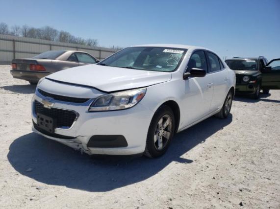</td>
<td>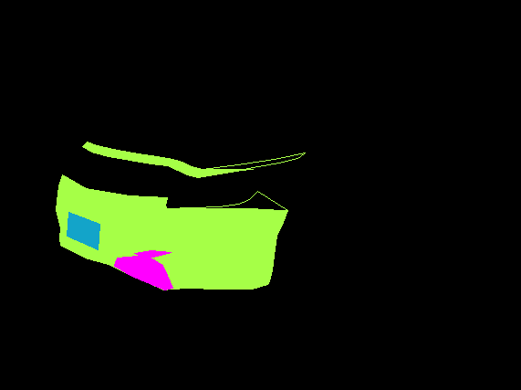</td>
<td></td>
</tr>
</table>

 
<h3>
References
</h3>
<b>1. Car Parts and Car Damages Dataset</b> 
Humans in the Loop 
<a href="https://humansintheloop.org/resources/datasets/car-parts-and-car-damages-dataset/">
https://humansintheloop.org/resources/datasets/car-parts-and-car-damages-dataset</a>
  
<b>2. TensorFlow-FlexUNet-Image-Segmentation-Model</b> 
Toshiyuki Arai  
<a href="https://github.com/sarah-antillia/TensorFlow-FlexUNet-Image-Segmentation-Model">
https://github.com/sarah-antillia/TensorFlow-FlexUNet-Image-Segmentation-Model
</a>
 
 
<b>3. TensorFlow-FlexUNet-Image-Segmentation-Car-Parts</b> 
Toshiyuki Arai  
<a href="https://github.com/atlan-antillia/TensorFlow-FlexUNet-Image-Segmentation-Car-Parts">
https://github.com/atlan-antillia/TensorFlow-FlexUNet-Image-Segmentation-Car-Parts
</a>
  
